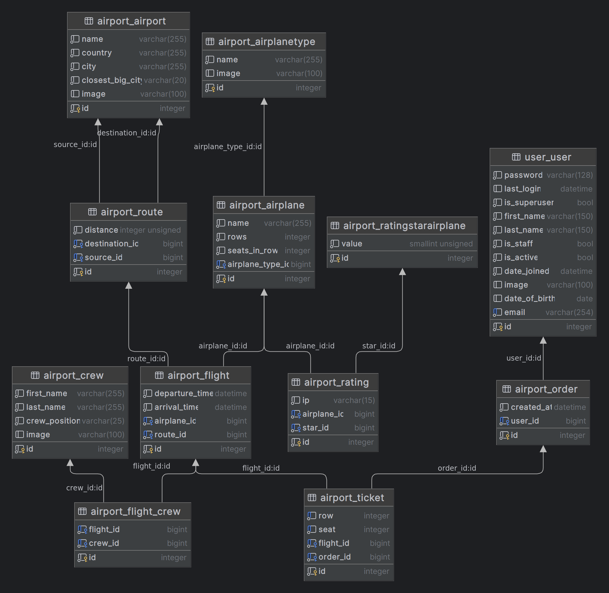

# AIRPORT SERVICE API

The RESTful API for a airport service platform. 

## User Registration and Authentication:

- Users can register with their email and password to create an account.
- Users can login with their credentials and receive a JWT token for authentication.
- Users can logout and invalidate their JWT token.

## User Profile:
- Users can create and update their profile, including profile picture and other details.
- Users can retrieve their own profile.

## Airport
- User with admin permission can create/update/retrieve/delete airport.
- User who is authenticated can retrieve airport.

## Route
- User with admin permission can create/update/retrieve/delete route.
- User who is authenticated can retrieve route.

## Crew
- User with admin permission can create/update/retrieve/delete crew.
- User who is authenticated can retrieve crew.

## Airplane
- User with admin permission can create/update/retrieve/delete airplane.
- User who is authenticated can retrieve airplane.
- User who is authenticated can add star (1-5) to airplane.

## Airplane type
- User with admin permission can create/update/retrieve/delete airplane type.
- User who is authenticated can retrieve airplane type.

## Flight
- User with admin permission can create/update/retrieve/delete flight.
- User who is authenticated can retrieve flight.

## Order and tickets
- User who is authenticated can can create/update/retrieve/delete 
order including few tickets.

## Payment system:
- Users can pay for order (functionality with Stripe).

## Filtering system
- User who is authenticated can filtering next endpoint: 
    - Airport (by name, country, city);
    - Route (by source, destination, distance);
    - Crew (by crew position);
    - Airplane (by name, rows, seats in row, airplane type);
    - Flight (by route, airplane, departure time, arrival time);
    - Order (by created at).

## API Permissions:
- Only authenticated users can perform actions such as creating order/tickets and add stars to the airplane.
- User with admin permission can create/update/retrieve/delete user profile, airport, route, crew, flight, 
airplane, airplane type, tickets, order, ratings.
- Users can update their own profile.

## API Documentation:
- The API well-documented with clear instructions on how to use each endpoint.
- The documentation include sample API requests and responses for different endpoints.

<<<<<<< HEAD
## Tests
- You can tests next endpoint:
  - Airport;
  - Route;
  - Crew;
  - Airplane;
  - Flight;

=======
>>>>>>> origin/main
## How to installing using GitHub

- Clone this repository
- Create venv: python -m venv venv
- Activate venv: source venv/bin/activate
- Install requirements: pip install -r requirements.txt
- Run: python manage.py runserver
- Create user via: user/register
- Get access token via: user/token

## Diagram of all models:
<<<<<<< HEAD

=======

>>>>>>> origin/main
